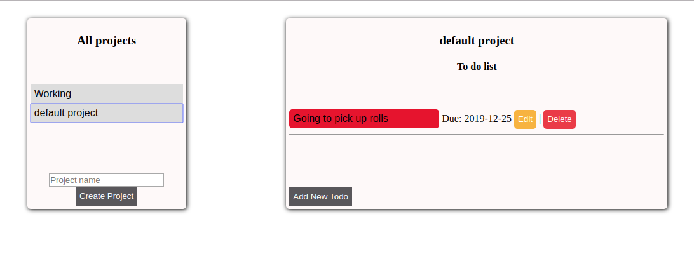

# Todo-list
At their most basic, to-dos contain all of the tasks that you need to complete on a given day. It's a great device for managing time that enables you to lay out everything that you need to accomplish and plan and prioritize your day from there.

[Live](https://oghenebrume50.github.io/Todo-list/dist/index.html)

## Technologies 
- HTML
- CSS
- Javascript
Used Webpack and Local Storage

## How to run Locally
- Clone repository
- `cd Todo-list`
- `npm run build` 
